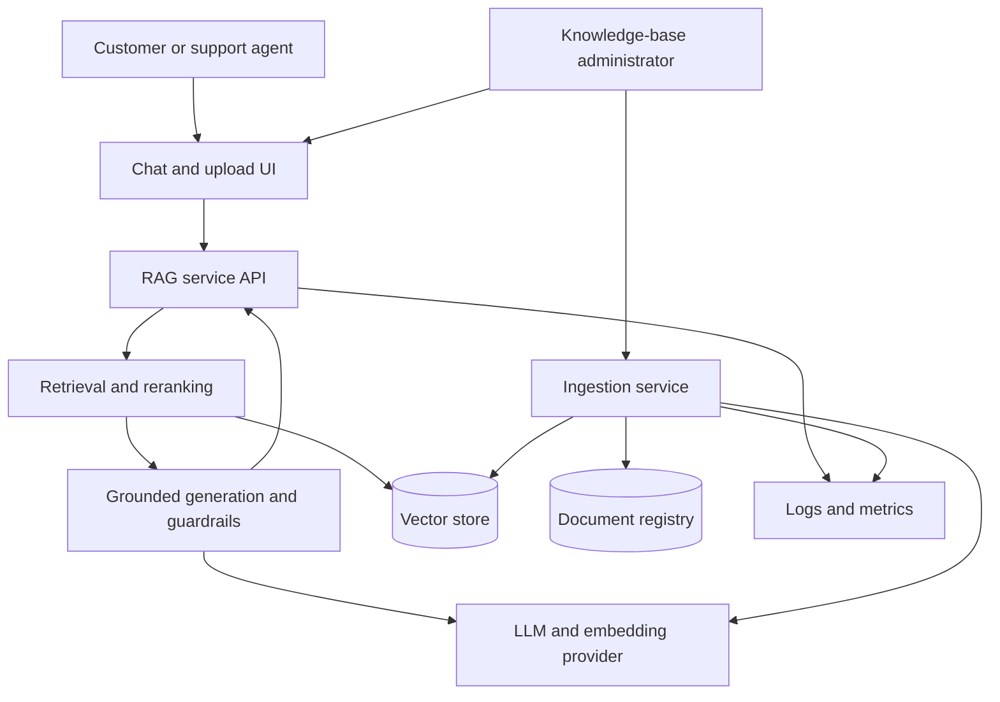

# End-to-End RAG Architecture

## 1. Architecture goals

The architecture prioritizes grounded answers, traceable citations, measurable
retrieval quality, safe refusal behavior, and replaceable infrastructure. It
separates document ingestion from online question answering so that source
documents can be validated and indexed without blocking customer queries.

## 2. System context



## 3. Offline ingestion flow

1. **Validate:** accept only supported, approved documents and capture owner,
   version, effective date, visibility, checksum, and source type.
2. **Extract:** convert content into normalized text while retaining source
   location such as page, heading, record, or section.
3. **Clean:** remove extraction noise without changing policy meaning.
4. **Chunk:** produce token-aware, overlapping, structure-conscious passages.
5. **Embed:** batch unchanged chunks and retry transient provider failures.
6. **Index:** upsert vectors and metadata under stable IDs.
7. **Verify:** compare expected documents/chunks with indexed counts and run
   retrieval sanity checks before marking the version active.

An ingestion failure must not replace the last known-good active version.

## 4. Online query flow

1. The API validates the question and current conversation identifier.
2. Follow-up context is rewritten into a standalone retrieval query when
   necessary.
3. The query is embedded and searched against permitted document scopes.
4. Candidate passages are filtered, optionally hybrid-searched, and reranked.
5. A score/evidence gate decides whether enough evidence exists.
6. Relevant passages are assembled inside the model's token budget with clear
   source boundaries.
7. The model returns a structured grounded answer referencing chunk IDs.
8. The service verifies cited IDs, applies refusal rules, and returns the
   answer plus user-readable citations.
9. Latency, retrieval scores, token usage, refusal state, and errors are logged
   without exposing secrets or unnecessary customer data.

## 5. Component responsibilities

| Component | Responsibility | Must not do |
|---|---|---|
| Web UI | Capture questions/uploads and display streaming answers, citations, status, and errors | Hold provider API keys or manufacture citations |
| RAG API | Validate requests, coordinate the pipeline, enforce access scope, and return a stable response contract | Read arbitrary local paths or expose internal stack traces |
| Ingestion service | Validate, extract, clean, chunk, embed, version, and index approved documents | Activate a partially failed document version |
| Retrieval service | Search, filter, rerank, threshold, and return passages with scores and metadata | Generate final policy claims |
| Generation service | Build grounded prompts, manage context, generate structured answers, and enforce refusal rules | Use model memory as policy evidence |
| Vector store | Persist embeddings, searchable text, stable IDs, and metadata | Become the source of document approval or authorization |
| Document registry | Track checksum, owner, version, status, and ingestion results | Store API secrets |
| Observability | Capture operational and quality signals | Log secrets or full sensitive documents by default |

## 6. Core contracts

### Chunk record

```json
{
  "chunk_id": "return-policy:v3:section-4:chunk-02",
  "document_id": "return-policy",
  "document_version": "v3",
  "document_type": "return_policy",
  "title": "Returns and Refunds",
  "section": "4.2 Electronics",
  "page": 7,
  "position": 2,
  "text": "...approved source text...",
  "checksum": "sha256:...",
  "effective_date": "2026-09-01",
  "visibility": "customer"
}
```

### Query response

```json
{
  "answer": "The policy-backed answer, or a clear refusal.",
  "status": "answered",
  "citations": [
    {
      "chunk_id": "return-policy:v3:section-4:chunk-02",
      "document": "Returns and Refunds",
      "location": "Section 4.2, page 7",
      "excerpt": "...supporting passage...",
      "score": 0.87
    }
  ],
  "request_id": "generated-request-id"
}
```

`status` is one of `answered`, `needs_clarification`, or `insufficient_evidence`.
An `answered` response must contain at least one citation whose `chunk_id`
exists in the retrieved context. Scores are diagnostic and must not be
presented as calibrated probabilities unless calibration is later proven.

## 7. Grounding and safety controls

- The system prompt limits policy claims to supplied context.
- Retrieval uses document visibility filters before generation.
- Low-confidence, empty, contradictory, or incomplete evidence triggers a
  clarification or refusal.
- Citation IDs returned by the model are checked against retrieved chunk IDs.
- Uploaded files are allow-listed by format and size, given generated storage
  names, and processed as untrusted input.
- Provider credentials are server-side environment variables and never enter
  browser responses, logs, repository history, or prompts.
- Document versions are immutable; activation is explicit and rollback keeps a
  last known-good index.

## 8. Failure handling

| Failure | User-facing behavior | System behavior |
|---|---|---|
| Unsupported or damaged file | Explain supported requirements | Reject before indexing and record a sanitized reason |
| Extraction produces empty text | Report that the document could not be processed | Keep existing active version unchanged |
| Embedding provider rate limit | Show processing as pending if asynchronous | Retry with bounded exponential backoff and preserve progress |
| Vector search unavailable | Explain that answers are temporarily unavailable | Do not call the LLM without evidence; emit an operational error |
| Weak/no relevant retrieval | State that the provided documents do not contain enough information | Return `insufficient_evidence` with no fabricated citation |
| Conflicting policy passages | Explain the conflict and name both sources | Prefer no automatic resolution; log for document-owner review |
| LLM timeout or malformed output | Show a retryable error | Retry only within a bounded policy; validate structured output |
| Invalid citation | Withhold the unsupported answer or mark insufficient evidence | Fail citation validation and record evaluation evidence |

## 9. Evaluation and observability

Retrieval and generation are evaluated separately:

- **Retrieval:** precision@k, recall@k, mean reciprocal rank, no-result rate,
  score distribution, and latency.
- **Answer:** correctness, groundedness, citation accuracy, refusal quality,
  unsupported-claim rate, and end-to-end latency.
- **Ingestion:** document/chunk counts, rejected files, failed chunks, version,
  checksum, duration, and last successful activation.
- **Operations:** request volume, cache hit rate, provider errors, token usage,
  and P50/P95 latency.

The evaluation set must include answerable, ambiguous, unsupported, follow-up,
exact-term, and conflicting-policy questions.

## 10. Deployment boundary

The UI communicates only with the application API. The API, ingestion worker,
vector store, registry, and provider credentials run in trusted server-side
infrastructure. Development may run these components in one process, but their
interfaces remain separate so they can be deployed independently when load,
security, or reliability requires it.

Provider and platform choices remain implementation decisions for their
dedicated module issues. The architecture depends on capabilities—embedding,
similarity search, metadata filtering, structured generation—not a specific
vendor.
