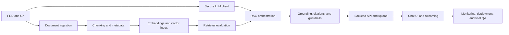

# Sprint 2 Delivery Plan — Policy-Grounded E-commerce Assistant

**Sprint period:** 6 October 2026–9 November 2026  
**Module coverage:** 3.1–3.50  
**Status:** Kick-off baseline  
**Primary tracking:** [GitHub issues](https://github.com/kalviumcommunity/e-commerce_s65_sprint2/issues)

## 1. Problem and intended outcome

The company has product catalogues, return policies, and seller agreements,
but its chatbot gives vague answers because those responses are not grounded
in the approved documents. Sprint 2 will deliver a RAG application that finds
the relevant source passages before generating a response.

The completed product must:

1. ingest and version approved company documents;
2. retrieve relevant passages for a customer's question;
3. generate a concise answer using only the retrieved evidence;
4. cite the source document and location;
5. ask for clarification or refuse when evidence is insufficient; and
6. expose the workflow through a usable chat interface and backend API.

The detailed business requirements, scope, risks, and success measures are in
the [PRD](../PRD.md).

## 2. Target users

| User | Need | Successful experience |
|---|---|---|
| Customer | A clear answer about products, returns, refunds, or seller obligations | Receives a direct, cited answer or an honest explanation that the documents do not contain the answer |
| Customer-support agent | Faster access to the correct policy passage | Can verify the answer against its cited source before replying to a customer |
| Knowledge-base administrator | Safe document updates | Can add an approved document and confirm it becomes searchable without corrupting the existing index |

## 3. Team responsibilities

| Member | Role | Primary ownership | Review responsibility |
|---|---|---|---|
| Hrithik (`hrithik18k`) | UI/UX, Documentation & QA | Product flow, chat UI, citation display, evaluation evidence, documentation, accessibility, deployment checklist | Verifies usability, empty/error states, citations, and acceptance evidence |
| Rohit (`itisrohit`) | LLM & RAG Engineer | LLM client, prompts, token management, embeddings, context assembly, generation, guardrails, conversational RAG | Reviews grounding, token use, model failure handling, and prompt safety |
| Nikhil (`Nikhil2510192`) | Data, Retrieval & Backend Engineer | Loading, cleaning, chunking, metadata, vector database, search, retrieval evaluation, query/upload APIs | Reviews data integrity, retrieval quality, API contracts, and indexing safety |

Ownership identifies the driver, not the only contributor. At least one other
team member reviews every pull request. Changes spanning component boundaries
require review from the owner of each affected component.

## 4. Milestones and dates

| Phase | Dates | Modules | Exit milestone |
|---|---|---|---|
| Foundation and product alignment | 6–12 October 2026 | 3.1–3.18 | PRD, UX flow, repository conventions, secure LLM client, prompt/output contracts, and token strategy are reviewed |
| Corpus ingestion and embeddings | 13–19 October 2026 | 3.19–3.29 | Supported documents are cleaned, token-aware chunks retain traceable metadata, and embedding quality checks pass |
| Vector retrieval and evaluation | 20–26 October 2026 | 3.30–3.36 | Idempotent indexing, filtered/hybrid retrieval, reranking, and repeatable precision/recall evaluation are working |
| Grounded RAG and safety | 27 October–2 November 2026 | 3.37–3.43 | The pipeline produces cited, grounded answers, handles follow-ups, refuses unsupported requests, and has quality scores |
| Product integration and delivery | 3–9 November 2026 | 3.44–3.50 | Backend APIs, document upload, streaming chat UI, monitoring, deployment, documentation, and final demonstration are complete |

### Milestone gates

- **Gate 1 — 12 October:** Architecture, PRD, prompt/output contract, and UX
  flow approved before full corpus processing.
- **Gate 2 — 19 October:** Ingestion validation and embedding sanity checks
  approved before production indexing.
- **Gate 3 — 26 October:** Retrieval evaluation meets the agreed baseline
  before LLM-answer quality is judged.
- **Gate 4 — 2 November:** Grounding, citation, and refusal tests pass before
  UI/API release preparation.
- **Gate 5 — 9 November:** Deployment smoke test and final submission
  checklist pass.

## 5. Module-to-owner map

The issue number is one greater than the module's decimal sequence because
GitHub issue and pull-request numbers share one repository-wide counter.

| Modules | Owner | Workstream |
|---|---|---|
| 3.1, 3.7, 3.8, 3.9, 3.10, 3.11, 3.13, 3.17, 3.18, 3.22, 3.24, 3.29, 3.40, 3.43, 3.46, 3.47, 3.48, 3.49, 3.50 | Hrithik | Product, UI, traceability, evaluation, QA, and delivery |
| 3.2, 3.12, 3.14, 3.15, 3.16, 3.25, 3.26, 3.27, 3.28, 3.35, 3.37, 3.38, 3.39, 3.41, 3.42 | Rohit | LLM, embeddings, RAG orchestration, grounding, and guardrails |
| 3.3, 3.4, 3.5, 3.6, 3.19, 3.20, 3.21, 3.23, 3.30, 3.31, 3.32, 3.33, 3.34, 3.36, 3.44, 3.45 | Nikhil | Ingestion, vector storage, retrieval, evaluation, and backend APIs |

Every module from 3.1 through 3.50 has a dedicated issue containing the task,
deliverables, acceptance criteria, dependencies, and assignee.

## 6. Delivery sequence and dependencies

Work may proceed in parallel only when its declared inputs are stable. For
example, UI development can use a mocked response contract while retrieval is
being built, but integration cannot be accepted until the real API satisfies
that contract.

## 7. Working agreement

1. Create a branch from current `main` for one scoped issue.
2. Use a descriptive branch name such as `feat/32-top-k-retrieval`.
3. Link the issue in the pull request and use `Closes #<number>` when the PR
   fully satisfies it.
4. Include tests, documentation, screenshots or sample responses as relevant.
5. Never commit API keys, customer conversations, confidential seller text, or
   generated vector-store files containing restricted content.
6. Obtain at least one teammate review; component-boundary changes need review
   from the affected component owner.
7. Merge only after automated checks pass and acceptance evidence is present.

## 8. Definition of done

A module issue is done only when:

- its acceptance criteria are demonstrably satisfied;
- tests and validation relevant to the change pass;
- public interfaces and operational steps are documented;
- errors and empty states fail safely;
- no secrets or unapproved documents are committed;
- the pull request links and closes its issue; and
- a teammate has reviewed the change.

Sprint 2 is done only when the deployed system completes this verified flow:

> approved document → extraction → chunking → embedding → indexing → customer
> question → retrieval → grounded answer → verifiable citation

It must also demonstrate a safe refusal for an unsupported question.

## 9. Initial technical decisions and limitations

- RAG is required so answers can be traced to approved evidence; the LLM's
  general knowledge is not an accepted policy source.
- Every chunk needs a stable ID and document/version/location metadata.
- Retrieval quality is evaluated separately from answer quality so failures can
  be diagnosed at the correct stage.
- API keys remain server-side and are loaded from environment variables.
- V1 supports text-based approved documents and a text chat experience.
- V1 does not perform refunds, returns, account actions, legal interpretation,
  voice interaction, multilingual support, or autonomous policy updates.
- Final model, embedding provider, vector database, and deployment platform
  remain replaceable until their module issues document a measured decision.

See the [architecture document](architecture.md) and
[ADR-0001](decisions/0001-grounded-rag-architecture.md) for the system boundary
and decision rationale.

## 10. Kick-off verification

- [x] Problem and target users documented.
- [x] Team roles and review responsibilities documented.
- [x] All modules 3.1–3.50 represented by assigned GitHub issues.
- [x] Five dated milestones and exit gates documented.
- [x] End-to-end architecture and component boundaries documented.
- [x] Technical decisions and V1 limitations documented.
- [x] Automated documentation validation added.
- [ ] Architecture and sprint baseline reviewed by a teammate.
